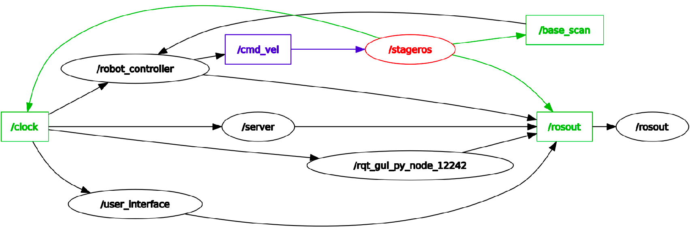

[Research Track I](https://corsi.unige.it/en/off.f/2021/ins/51201)<br>
**Programmer:** [Ankur Kohli](https://github.com/ankurkohli007)<br>
[M.Sc Robotics Engineering](https://corsi.unige.it/corsi/10635)<br>
[University of Genoa (UniGe), Italy](https://unige.it/en)<br>
**Supervisor:** [Prof. Carmine Tommaso Recchiuto](https://rubrica.unige.it/personale/UkNDWV1r)

# Assignment 2: Monza Raccing Circuit

## Abstract
This assignment analyzes how to control the robot using [ROS](https://www.ros.org/) (Robot Operating System). The robot is endowed with laser scanners. There were different nodes were design to control the robot. Also, one additional node which interacts with the user to increase/decrease the speeed of the robot and reset the position of the robot. For this, ***cpp*** programing is used. 

## Introduction
In this assignment, a controller that runs on ROS. A simple robot which runs autonomously on a track which is basically the reproduction of the [Monza Racing Circuit](https://www.monzanet.it/en/). The robot runs on a track and alos avoides the collision with the walls. Lastly, user interface node is designed which gives access to the users to operate robot's and also change it's behaviour such as increase/decrease of the speed, resetting the robots position.

## Objective
This assignment objective to create a ROS Package which have the ability of designing a robot equipped with the laser scanners, a lap around a given circuit. Moreover, package conists of the cpp sources needed for the interaction with the robot. The world where the robot has to run autonomously is a simple 3D model of the actual Monza's F1 circuit. ROS is a group os tools and libraries for autonomous, robust, efficient, and secure mobile robot navigation, which uses sensors to sense the surroundings and computer vision techniques as the navigation method.

The robot behaviour has to fullfill the following criteria while running on the circuit:

* Continously moving around the world in the **clockwise direction**
* Speed can **increase** or **decrease** according to user choice
* Position of the robot can be **reset** any time when user wish to do so.

The user can easily control the robot operations by using **Keyboard Keys**:

* By giving an input as `l/L`, this will **ACCELERATE** the robot's speed by **half unit** at every input from the keyboard by user end.
* * By giving an input as `j/J`, this will **DECELERATE** the robot's speed by **half unit** at every input from the keyboard by user end.
* * By giving an input as `r/R`, this will **RESET** the robot's position at every input from the keyboard by user end.
* By giving an input as `q/Q`, thi will **QUIT** the session. 

## World
The circuit as shown in figure below is the **WORLD** where robot runs autonomously and perform it's operations as per user inputs. The robot is represented as a blue point which is equipped with laser scanner. The light blue area is the area scanned by the laser sensors on the robot.

 

<p align="center">
    <em>Monza Raccing Circuit World</em>
</p>

The ```world``` node publishes messages on the ```/base_scan``` topic. Messages are ```LaserScan``` type, from ```sensor_msg``` package, and they provide the result of a single scan by the robot's laser sensors.

It also subscribes to the topic ```/cmd_vel``` to impose a linear and angular velocity to the robot along the three axis. It receives ```Twist``` type messages from ```geometry_msgs``` package.

## Intalling & Running 

## Installation

For this assignment, simulation requires [ROS Noetic](https://wiki.ros.org/noetic/Installation). After installing ROS Noetic on your system clone the [Prof. Carmine Tommaso Recchiuto](https://github.com/CarmineD8/second_assignment). this repository contains the main workspace for running the simulation world. The source includes the *CmakeList* for compiling the node and the *World* file for building the scene.

The package developed during the assignmnet are as belows: 

* An *autopilot_node*, this node will initiates the movement of the robot from the initial position in clockwise direction. Also, aims to guide the robot to avoid collision into the walls of the circuit.
* A *host_node*, this node is the Server node which handles service to manage request from the user and give the responce to the user node. Lastly, this node will process the Keyboard input and change the robot's behaviour such as increase/decrease the speed and resets the position of the robot. 
* A *user_interface_node*, This node will takes input from the user and send the request to the server node and waiting for the response from the server node. Finally, this node will give access to the user and user can interacts with the simulation with the Keyboard inputs and controls the robot's operations. 
* ONE *custom service* ```Velocity.srv``` needed by the server node to exchange data between the *request* and the *response*.
* ONE *custom message* ```Vel.msg``` needed to pass the acceleration factor from the service to the controller through the use of a topic.

## Running the program

* After cloning the repository from the aforementioned *GitHub* link, copy the `second_assignment` folder which is included in the cloned repository and paste in the src folder which is inside local ROS workspace directory or else you can directly clone the aforementioned repository in your src folder of the local ROS workspace. 
* Now, back to your ROS worksapce folder, run the command ```catkin_make```. This command will build all the scripts in the package.
* After building, run rospack profile in order to refresh or update your packages. 
```
rospack profile
```
* Now, follow the steps given below to run the simulation:

**Step 1:** Open a terminal, and run the master node in terminal to run the ROS in your PC by the following command: 
```
roscore &
```
**Step 2:** After execution of master node, in the same terminal run the **world simulation** by the command to launch the robot in the given world. 
```
rosrun stage_ros stageros $(rospack find second_assignment)/world/my_world.world
```
**Step 3:** Now, open the another terminal window and execute the command for `robot controller node`. This node will launch the robot autonomously and avoiding the collision with the wall.
```
rosrun second_assignment autopilot_controller_node
```
**Step 4:** After that, open another terminal window and run the command for `server node`. This node tackles the services to manage request from the user end and give response to the user node.
```
rosrun second_assignment host_node
```
**Step 5:** Finally, for the last time open new terminal window and the execute the command for `user interface node`. This node will receive the inputs from the user end and send request to the `host_node` and waits for the response from the same node.
```
rosrun second_assignment user_interface_node
```
## NODES Descriptions & their logics

## Simulation Node: StageRos node (stage_ros package)

The stageros node wraps the Stage 2-D multi-robot simulator, via libstage and this node is used for the simulation is the standard node `StageRos`. Stage simulates a world as defined in a .world file. This file tells stage everything about the world, from obstacles (usually represented via a bitmap to be used as a kind of background), to robots and other objects.

The **robot controller node** works with the **stageros node**, which should also be running. The communication with the aforementioned node occurs through **topics**, to which the controller subscribes. In particular:
1 - "/base_scan" from which sensor data is acquired (related to obstacles)
2 - "/cmd_vel" through which the robot can be commanded with ROS geometry_msgs::Twist messages

Also, this node only exposes a subset of Stage's functionality via ROS. Specifically, it finds the Stage models of type laser, camera and position, and maps these models to the ROS topics given below. If at least one laser/camera and position model are not found, stageros exits.

Stageros only exposes models created by a subset of the `.world` file syntax, specifically `laser`, `position` and `camera` models.

* Parameters:
    * world : The Stage .world file to load.
    * -g : If set, this option will run stage as "headless," no GUI will be displayed.
* Subscribers:
    * The node **subscribes** to the `cmd_vel (geometry_msgs/Twist)` topic, to manage the velocity of the robot.
* Publishers: The node **publishes** to the following topics:
    * `odom (nav_msgs/Odometry)`: odometry data of the model. 
    * `base_scan (sensor_msgs/LaserScan)`: __scans from the laser model. We will use this one.
    * `base_pose_ground_truth (nav_msgs/Odometry)`: __the ground truth pose. We will use this one.
    * `image (sensor_msgs/Image)`: visual camera image.
    * `depth (sensor_msgs/Image)`: depth camera image.
    * `camera_info (sensor_msgs/CameraInfo)`: camera calibration info.
* Usage:
```
rosrun stage_ros stageros [-g runs headless] <world> [standard ROS args]
```
***Nodes Topic StageRos RQT Graph*** 


<p align="center">
    <em>RQT Graph: Nodes Topic StageRos</em>
</p>

***Nodes Topic Active StageRos RQT Graph*** 


<p align="center">
    <em>RQT Graph: Nodes Topic Active StageRos</em>
</p>

## Robot Controller Node: autopilot_controller_node

Robot Controller Node will drives the robot autonomously. Also, while moving inside a circuit robot's have the ability to avoid the collision among the walls. t will command the robot to drive at a certain velocity inside the track. In this node, robot will also be able to scan the walls of the circuit and not hit them. The robot subscribes and publishes to the following topics: 

* The node **publishes** to the `cmd_vel geometry_msgs/Twist` Topic to change the *linear* and *angular* velocity values related to the robot.

* The node **subscribes** to the following topics:

    * `base_scan (sensor_msgs/LaserScan)`:  which will provide the node with Data about the enviroment surrouding the robot.
    * `Acc (second_assignment/Acc)`:  Which will tell the node how much to increase the *linear* velocity of the robot on the `cmd_vel` Topic.

Here, some inputs and outputs for the laser scanner.

* **INPUTS**:
    * `float laser_array[720]`: The laser range array. 
    * `int init = 0`: The initial index from which the function will start checking for the minimum value.
    * `int capacity_laser = 720`: This is the laserscapacity, also tells how laser function will proceed.

* **OUTPUTS**:
    *  `float value`: The minimum distance registered tin the assigned area.
    
```cpp
float mini ( float arr[720], int ind=0, int size=720)
{


    float value = 40.0;
    
    for(int j= init; i < init+capacity_laser; j++)
    {
    
        if (value >= laser_array[j])
        {
            value = laser_array[j];
        }
    }
    return value;
}
```
After launching of the **Monza Raccing Circuit** and also after launching of the `robot controller node` i.e. named as `autopilot_controller_node`, he robot will move around the circuit at a constant velocity of 1.0 towards its relative x-axis resulting in a forward motion. This speed may vary depending on the accelleration factor given by the user. his float number is stored in the `acc` variable which is added to the initial linear speed. Through the `user_interface_node` the user can either rase or slow down the speed factor by 0.5 notchs.Once the middle detecting area scans a distance shorter than 1.5 units, the robot will stop driving forward and it'll check on the other detecting regions.

<p align="center">
  
</p>

<p align="center">
    <em>Robot truns on curves</em>
</p>

Above *gif* shows the turning of the robot on the curves.

After evervy cycle, the speed of the robot will published on the `cmd_vel` topic. Output generated by the `autopilot_controller_node` as shown in figure below.


<p align="center">
    <em>Output of autopilot_controller_node</em>
</p>

Below is the definition of the `autopilotCallBack` function. This shows how the functions plays a role in the task. 

```cpp

void autopilotCallBack(const sensor_msgs::LaserScan::ConstPtr& msg) 
{
		float laser[721];
		int i = 0;
		for(i = 0; i < 721; i++)
		{
		laser[i]=msg->ranges[i];
		}
		
		if (minimum(laser, 310, 100) > 1.5)
		{
		
			if ((counter--) <= 0)
			{
			
								
				cout<<"Linear Velocity: "<<1.0+velocity;
				cout<<"Angular Velocity: "<<0.0;
				
				my_vel.linear.x = 1.0+velocity;
				my_vel.angular.z = 0.0;
			}
			
			else
			{
				cout<<"Linear Velocity"<<1.0+(velocity*linear_multiplier);
				cout<<"Angular Velocity: "<<0.0;
				
				
				my_vel.linear.x = 1.0+(velocity*linear_multiplier);
				my_vel.angular.z = 0.0;
			
			}
			
		} 
		else
		{
			if (minimum(laser,0,100) < minimum(laser,620,100))
			{
				cout<<"Linear Velocity"<<0.2;
				cout<<"Angular Velocity: "<<1+(velocity*angular_multiplier);
				
				my_vel.linear.x = 0.2;
				my_vel.angular.z = 1+(velocity*angular_multiplier); 
			}
			
			else 
			{
				cout<<"Linear Velocity"<<0.2;
				cout<<"Angular Velocity: "<<(-(1+(velocity*angular_multiplier)));
				
				my_vel.linear.x = 0.2;
				my_vel.angular.z = -(1+(velocity*angular_multiplier)); 
			}
			counter = 5;			
		}
				 
		pub.publish(my_vel);
}
}
```

For the velocity another function is declared named as `velocityCallBack` which will *subscribes* to `Vel` topic. This will retrieve the velocity set by the user interface. The code below shows the definition of the `velocityCallBack` function.

```cpp
void velocityCallBack(const second_assignment::Vel::ConstPtr& msg1)
{
	velocity = msg1->a;
    ROS_INFO("[%f]", velocity + 1.0);
}
```
To execute this node run the command 
```
rosrun second_assignment autopilot_controller_node
```
Another function called `autopilotCallBack`, this will execute a cycle that will determine what velocity to publish on the `cmd_vel`  topic. 


<p align="center">
    <em>Flow chart of autopilotCallBack</em>
</p>

Figure above shows the process of `autopilotCallBack` function.

## Server Node: host_node

This is the server node named as `host_node` which manages the velocity factor of the robot. The Server node exploits the *custom server* `second_assignment/Velocity` to receive a **request** and produce a **response** in the user interface node. 

The service is advertised inside of the *bool function*  `char_input`. The **request** associated with a `char` value will either:

* Send a **response** to *increase* the acceleration factor by 0.5 units if the `char` value is equal to `l/L`,
* Send a **response** to *decrease* the acceleration factor by 0.5 units if the `char` value is equal to `j/J`,
* Call the service `/reset_positions (std_srvs/Empty)` to RESET the position of the robot and setting to 0 the robot's acceleration factor if the `char` value is equal to `r/R`,
* Give an **ERROR** message if incoorect character  `char` value is entered from the user end.
* Send a **response** to *quit* the robot operations if the `char` value is equal to `q/Q`,

Once either the  `j/J` or the  `l/L` are pressed, the global variable  `acc` will either increase or decrease by half a unit. This variable will later be assigned to the **response** of the service. The code below shows the *bool monitor()* for char_input`.

```cpp
bool monitor(second_assignment::Velocity::Request &req, second_assignment::Velocity::Response &res)
{
       cout << req.input << endl;	
	if(req.input == 'j' || req.input == 'J')
	{
		speed = speed + 5.0;
		
	}	
	if(req.input == 'l' || req.input == 'L')
	{
		speed = speed - 5.0;
		
	}
	if(req.input == 'r' || req.input == 'R')
	{
		ros::service::call("/reset_positions", reset_server);
	}
	res.output = speed;   
	return true;
	res.output = speed;   
	return true;
}
```
To execute this node run the command 
```
rosrun second_assignment host_node
```


<p align="center">
    <em>Output of host_node</em>
</p>

Figure above shows the process of `host_node` terminal.

## User Interface Node: user_interface_node 

This is the user interface node which communicates with the user to input the command and give the response to the user node. The `std::cin>>` will associate the `char` input to a `char` variable that will later be passed as a **request** of the *ros::ServiceClient client1*. The client will send the request to a service of type `/Velocity`. The service will associate the read `char` to the increase or the decrease of the speed variable. The node will later associate the **response** of the service to the `float` variable of the `my_vel.a (second_assignment/Vel)` variable of the custom message `/acc`. At last, the `float` variable will be **published** to the Topic to pass the information about the acceleration factor inside the controller. The code below shows the *interfacing()*.


```cpp
void interfacing()
{

	//Creating velocity object which will send the updated data to the controller
	
	second_assignment::Velocity vel_srv;

	//Reading the input entered by the user

	char inp = GetChar();

	//Sending the request as the user's input
	
	vel_srv.request.input = inp;

	//If user give input as 'q' or 'Q' than it will quit the program and manage the errors

	if(inp == 'q' || inp == 'Q') 
	{
	
	halt = true;
	
	}
	
	if(inp != 'q' && inp != 'Q' && inp != 'j' && inp != 'J' && inp != 'l' && inp != 'L' && inp != 'r' && inp != 'R') 
	{
	
	cout<<"Sorry!! WRONG INPUT ENTERED!! Please, try with the new input as specified in the control menu, Thanks!";
	
	}

	////waiting for service existence
	
	client1.waitForExistence();
	
	//now sending request
	
	client1.call(vel_srv);

	//Declaration of custom message to send the response to autopilotrobot.cpp
	
	second_assignment::Vel my_vel;
	
	//Here, assigning the value of the response of the service to the custom message 
	my_vel.a = vel_srv.response.output;
	
	//Now, publishing the value to the correct topic
	pub.publish(my_vel);
}
```
To execute this node run the command 
```
rosrun second_assignment user_interface_node
```


<p align="center">
    <em>Output of user_interface</em>
</p>

Figure above shows the process of `user_interface_node` terminal.

The function spins on the `main()` function as long as ROS is running with a `while(ROS::ok())` loop. In code below:
```cpp
int main (int argc, char **argv) 
{	
	ros::init(argc, argv, "user_interface"); 
	ros::NodeHandle nh; 
	pub = nh.advertise<second_assignment::Vel>("/accval", 10); 
	client1 = nh.serviceClient<second_assignment::Velocity>("/accelarate");
	while(ros::ok() && !halt)
	{
		interfacing(); 	
		ros::spinOnce(); 
	}

	return 0;
}
```

## Architecture of the assignment


<p align="center">
    <em>Architecture of the project</em>
</p>

Figure above shows the *Assignment Architecture*.

## Performance of AutoPilot Robot in Monza Raccing Circuit


<p align="center">
    <em>Final output</em>
</p>

Above *gif* shows the *Performance of AutoPilot Robot in Monza Raccing Circuit*.

## Conclusion 

In the end, the assignment structure is designed using modular logic. The work overall satisfied me especially because this is the first real kind of project I've ever approached with ROS. I understood the potentional of this tool and what can be easily created with it. To check the `RQT` Graph run the following command: 
```
rosrun rqt_graph rqt_graph
```


<p align="center">
    <em>Final RQT Graph</em>
</p>

Figure above shows the *RQT Graph* of the assgnment.

## Improvements 

The controller can be improved by making the execution of the curves more precise and trying to modulate the speed better. Moreover, all the algorithm managing the direction and speed of the robot can be improved because, as we can see when running, the robot has difficult when turning in the circuit. Lastly, the user interface has simple outputs and visuals for the user. If the User interface node had more aesthetic values it can be easier to use and appreciatable.

